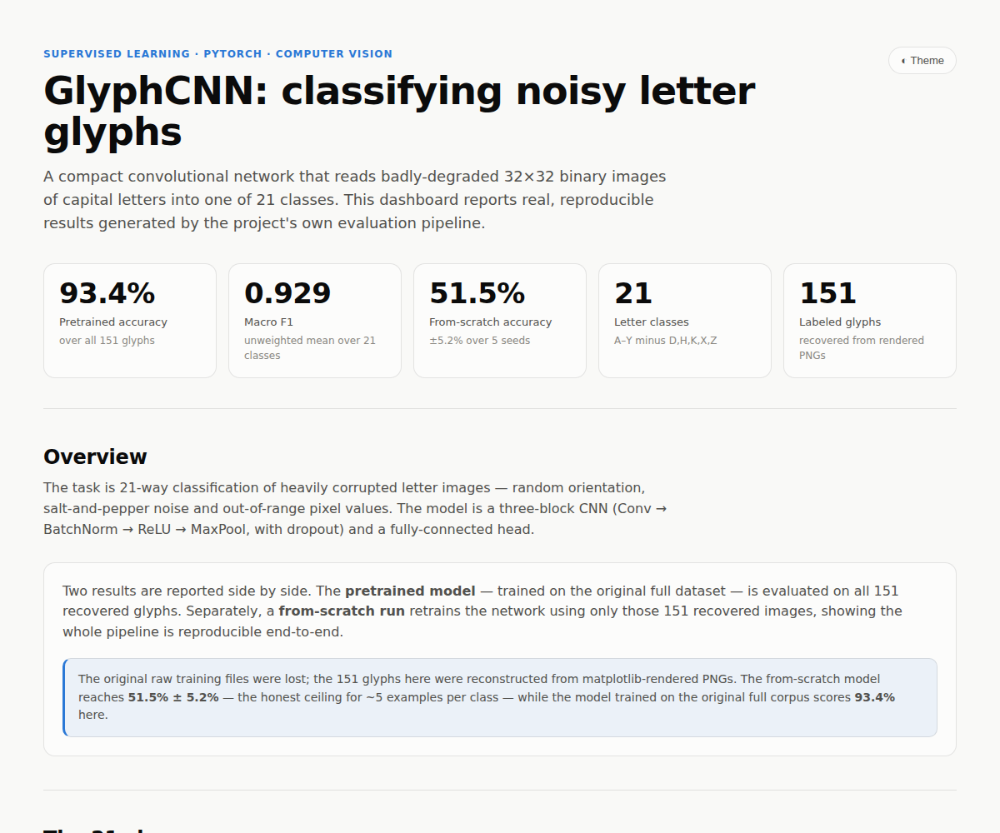
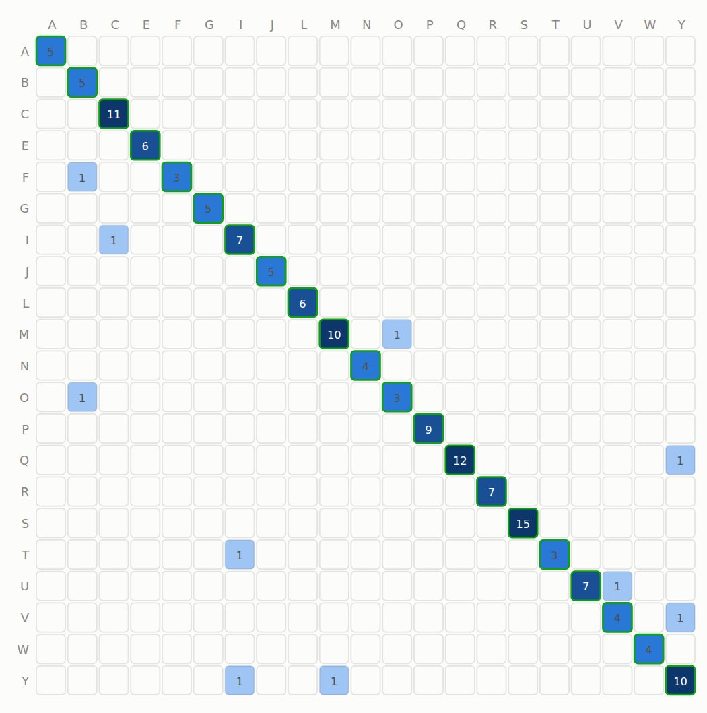
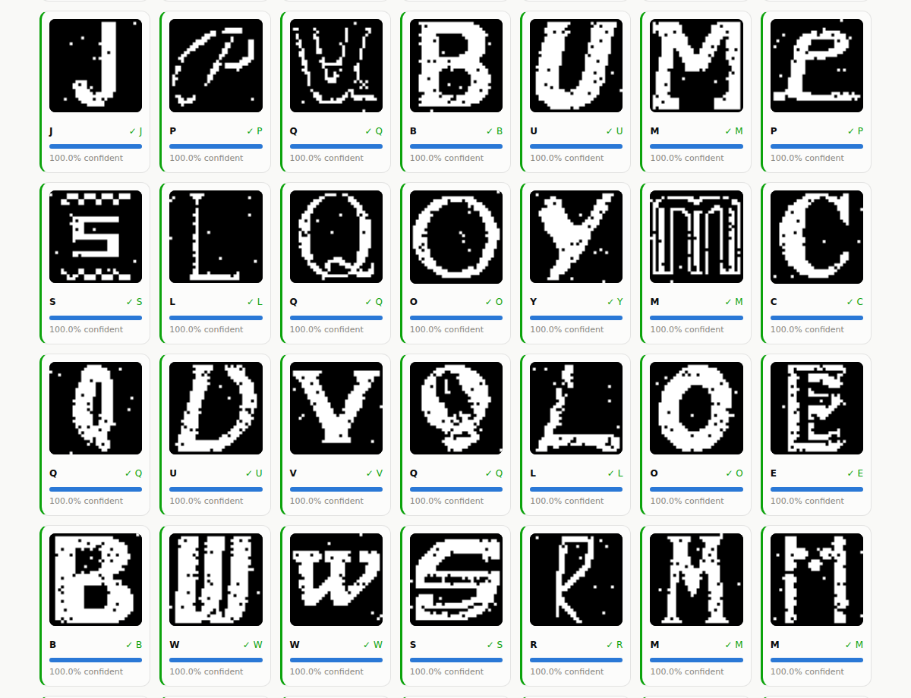

<h1 align="center">GlyphCNN</h1>

<p align="center">
  A compact PyTorch CNN that classifies heavily-degraded 32×32 binary images of
  capital letters into <b>21 classes</b> — with a reproducible, config-driven
  pipeline and an interactive results dashboard.
</p>

<p align="center">
  
  
  
  
  
</p>

<p align="center"></p>

> **Project story.** This is a revamp of one of my first machine-learning
> projects (a 3rd-year supervised-learning assignment). The original code worked
> but ignored most software- and ML-engineering conventions: a single flat
> script, hard-coded paths, no tests, no packaging, no reproducibility controls.
> This repository rebuilds it as a modular, tested, reproducible pipeline and adds
> a static results dashboard. The original scripts are preserved untouched under
> [`legacy/`](legacy/).

---

## Results

| Model | Data | Accuracy | Macro-F1 |
|-------|------|:--------:|:--------:|
| **Pretrained** (trained on the original full corpus) | all 151 recovered glyphs | **93.4%** | **0.929** |
| **From scratch** (this repo, 5-seed cross-validation) | 151 recovered glyphs only | 51.5% ± 5.2% | — |

The two numbers answer two different questions. The **pretrained** model shows how
well the architecture actually solves the task. The **from-scratch** number is the
honest ceiling when training on *only* the 151 images that could be recovered
(≈5 examples per class) — it exists to prove the pipeline runs end-to-end and is
reproducible, not to be a headline.

<p align="center">
  
  
</p>

Open **[`site/index.html`](site/index.html)** for the full interactive dashboard
(hero metrics, class gallery, training curves, confusion matrix, per-class metrics
and every classified sample with its confidence). It is a single self-contained
file — host it on GitHub Pages or open it locally.

## The data — and how it was recovered

The task is 21-way classification of corrupted letter glyphs: random orientation,
salt-and-pepper noise and out-of-range pixel values. The 21 classes are the
capital letters **A B C E F G I J L M N O P Q R S T U V W Y** (the alphabet minus
D, H, K, X, Z).

The original raw pixel text files (`traindata.txt`, …) were lost; all that survived
were 151 matplotlib-rendered PNGs with `idx`, `orient` and `label` encoded in each
filename, plus a pretrained checkpoint. `scripts/reconstruct_dataset.py` recovers
the underlying 32×32 binary arrays by isolating the viridis data-region in each
render, resampling to 32×32, and applying the project's orientation-correction
convention. That convention was **validated empirically**: once applied, the
pretrained model scores 93.4% on the recovered glyphs, confirming the
reconstruction is faithful.

## Project structure

```
glyphcnn/
├── src/glyphcnn/          # the installable package
│   ├── config.py          # single dataclass Config — every run is described here
│   ├── data.py            # dataset, stratified split, augmentation, {0,255} scaling
│   ├── model.py           # GlyphCNN (3 conv blocks + FC head)
│   ├── engine.py          # train / eval loops: scheduler, early stopping, checkpoints
│   ├── metrics.py         # pure-numpy accuracy / confusion / precision-recall-F1
│   ├── predict.py         # inference — the modern replacement for classifyall.py
│   ├── viz.py             # matplotlib report figures
│   └── cli.py             # `python -m glyphcnn {train,evaluate,predict}`
├── scripts/
│   ├── reconstruct_dataset.py   # PNGs → data/processed/dataset.npz
│   ├── build_dashboard.py       # reports/ → site/index.html
│   └── dashboard_template.html
├── tests/                 # pytest suite (metrics, data, model, reconstruction)
├── data/processed/        # dataset.npz + per-class sample PNGs
├── models/                # trained_model checkpoints
├── reports/               # metrics JSON + figures (dashboard inputs)
├── site/index.html        # the static results dashboard
├── legacy/                # original 3rd-year scripts (unmodified)
├── .github/workflows/     # CI: lint + test on 3.10–3.12
└── pyproject.toml
```

## Quickstart

```bash
# 1. install
pip install -e ".[dev]"          # or: pip install -r requirements.txt

# 2. (re)build the dataset from the rendered PNGs
python scripts/reconstruct_dataset.py --src data/raw_png/images --out data/processed

# 3. train from scratch (writes checkpoints + reports/)
python -m glyphcnn train

# 4. evaluate the pretrained model on every recovered glyph
python -m glyphcnn evaluate --checkpoint models/pretrained_model.pth --split all

# 5. rebuild the dashboard from the fresh reports
python scripts/build_dashboard.py
```

A `Makefile` wraps these as `make data | train | evaluate | pretrained-eval |
dashboard | test | lint`.

## Model

Three convolutional blocks — `Conv(3×3) → BatchNorm → ReLU → MaxPool(2×2) →
Dropout` with 32 → 64 → 128 channels — reduce a 32×32 input to 4×4×128, followed by
a 256-unit fully-connected layer (BatchNorm + dropout) and a 21-way classifier.
Layer shapes are kept identical to the original so the historical checkpoint loads
directly. Training uses Adam, cross-entropy with label smoothing,
`ReduceLROnPlateau`, and early stopping on validation loss. Because the recovered
set is tiny, training applies light label-preserving augmentation (small
translations + salt-and-pepper flips) and a stratified split so every class appears
in train, validation and test.

## Engineering notes

Everything that defines a run lives in one serialisable `Config` dataclass; runs
are seeded end-to-end (`random`, `numpy`, `torch`, cuDNN) for reproducibility.
Metrics are dependency-light pure numpy and unit-tested. The suite also asserts the
architecture stays compatible with the historical checkpoint, so a refactor that
would break it fails CI. Linting is `ruff`; tests are `pytest`; CI runs both across
Python 3.10–3.12.

## Development

```bash
make test      # pytest
make lint      # ruff check
```

## License

[MIT](LICENSE) © Jassiel Nkosi
